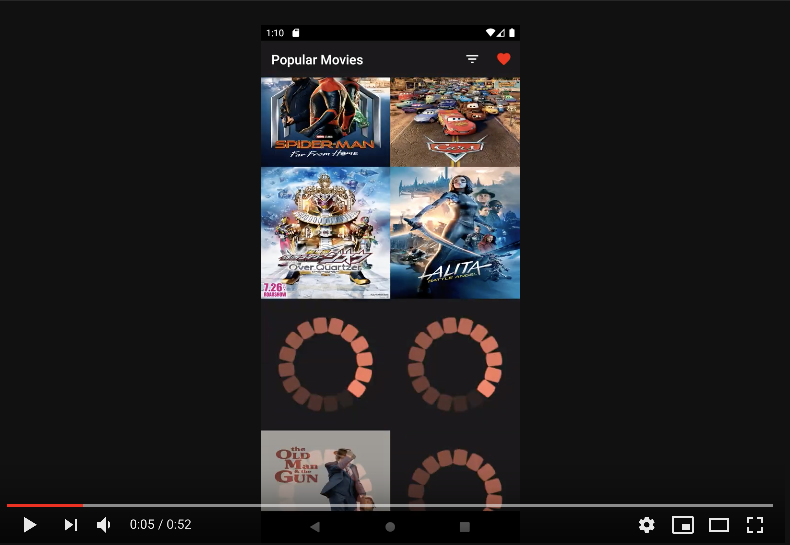

# PopularMoviesApp
Popular Movies Application for Udacity Nanodegree android developer course

Contains:
- MVVM architecture
- Dependency injection with dagger
- Clean architecture approach with modularisation
- DiffUtil to update recyclerview
- RxJava for multithreading
- Retrofit for network calls
- Picasso to display images
- Services for caching data
- Mappers for mapping different entities from the different modules
- Android dataBinding library for binding data to layout views

   
  
  
  
  
  

